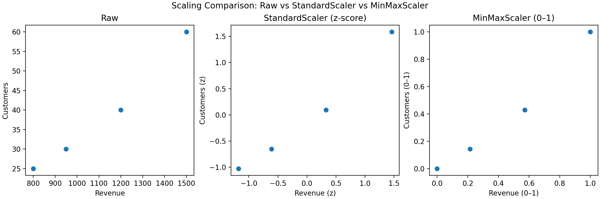
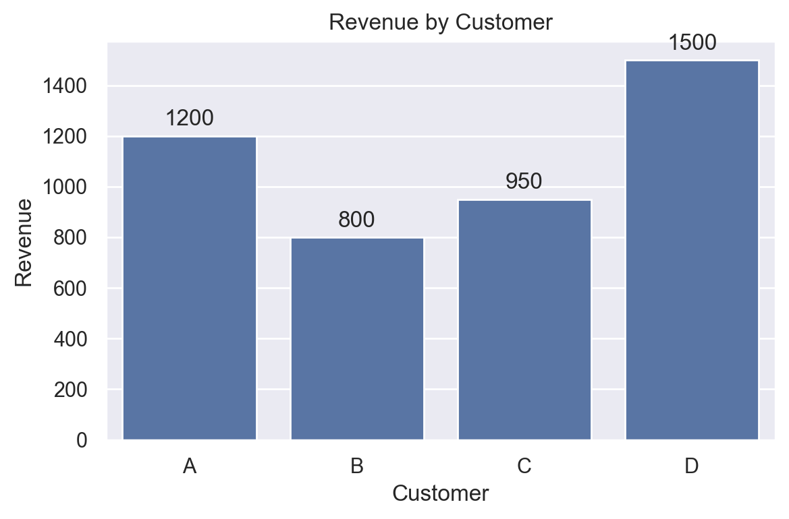

# Packages that Make Business Analytics an Easy Ride

## Introduction

Business analytics is all about **transforming raw data into actionable insights** that help companies make smarter decisions. If you’ve ever looked at sales numbers, customer churn, or revenue growth and thought, “How can I model this better?”—you’re in the right place.  

In this post, we’ll walk through some of the most useful Python packages for business analytics. You’ll see industry staples like pandas and scikit-learn, along with a few specialized tools that often go under the radar. By the end, you’ll know not only what to use, but also when and why.  

---

## Why Packages Matter in Business Analytics

These packages are everywhere and the biggest reason is because these pckages save companies time. All of these packages are so helpful and cover multiple different skills such as:

- Cleaning messy data
- Scaling values like revenue and customer counts for fair comparison
- Building predictive models to forecast trends
- Creating compelling visualizations for stakeholders  

A business analyst's job isn’t just to crunch numbers—it’s to **communicate insights clearly and efficiently**. The right package can be the difference between hours of frustration and a clean solution in minutes. In addition, it allows for smooth repeatability which is essential in large companies!

---

## Core Packages You’ll Use All the Time

### 1. pandas
We've learned about this already in class and it's important because pandas is like a Swiss Army knife for data wrangling. It gives you fast, flexible ways to store, manipulate, and analyze large amount of data.

#### Example: load a simple dataset
```python
import pandas as pd

data = pd.DataFrame({
    "Customer": ["A", "B", "C", "D"],
    "Revenue": [1200, 800, 950, 1500]
})
print(data.describe())
```
This produces descriptive statistics for your dataset (mean, standard deviation, min, max) which is **essential for a first step in understanding business data**.  

---

### 2. scikit-learn

When you’re ready to move from exploration to modeling, scikit-learn has your back. We haven't learned as much about this in class yet, but I believe that it's extremely useful because it’s widely used for machine learning but also shines in data preprocessing.  

The place this package really shines is with its scaling features. These features allow for fair comparison between to values that are drastically and significantly different. It is important to have something that allows for us as the data analyst to view the actual relationship between our esssential values. For example,rRevenue values may be in the thousands, while customer counts are in the hundreds. Directly comparing them would skew your model. This is where **StandardScaler** and **MinMaxScaler** come in handy.

```python
from sklearn.preprocessing import StandardScaler, MinMaxScaler
import numpy as np

# Example data: revenue vs. customers
X = np.array([[1200, 40],
              [800, 25],
              [950, 30],
              [1500, 60]])

# Standardization: mean=0, variance=1
scaler = StandardScaler()
X_standardized = scaler.fit_transform(X)

# Normalization: values between 0 and 1
minmax = MinMaxScaler()
X_normalized = minmax.fit_transform(X)

print("Standardized:\n", X_standardized)
print("\nMinMax Scaled:\n", X_normalized)
```


With the power of scaling, we can clearly start to see some of the smaller details that would otherwise be missed without scaling. This allows us to make our data clear and fair as we start modeling.

---

### 3. matplotlib and seaborn

These two packages are usually used in tandem and are wizards when it come to visualizations. From the research that I've done, I've found that there are very few companies that don't commonly use these packages because of the extensive and useful tools they possess. This is especially important because a good picture speaks a thousand words. 

```python
import seaborn as sns
import matplotlib.pyplot as plt

sns.barplot(x="Customer", y="Revenue", data=data)
plt.title("Revenue by Customer")
plt.show()
```

*Figure: Bar chart of revenue by customer generated with seaborn.*

Look how clean and simple this graph is! It is all thanks to matplotlib and seaborn. In addition, the types of graphs that you can create are vast, with plenty of options to suit whatever needs a large company might have. 

### Lesser Known but Powerful Packages
* **statsmodels**: Perfect for regression and hypothesis testing. Want to see if marketing spend really predicts revenue growth? This is your tool.

* **pyjanitor**: Adds simple functions on top of pandas for data cleaning. Tasks like removing empty rows or encoding categories become one-liners.

* **pmdarima**: Specialized for time series forecasting, especially helpful when projecting sales over months or quarters.